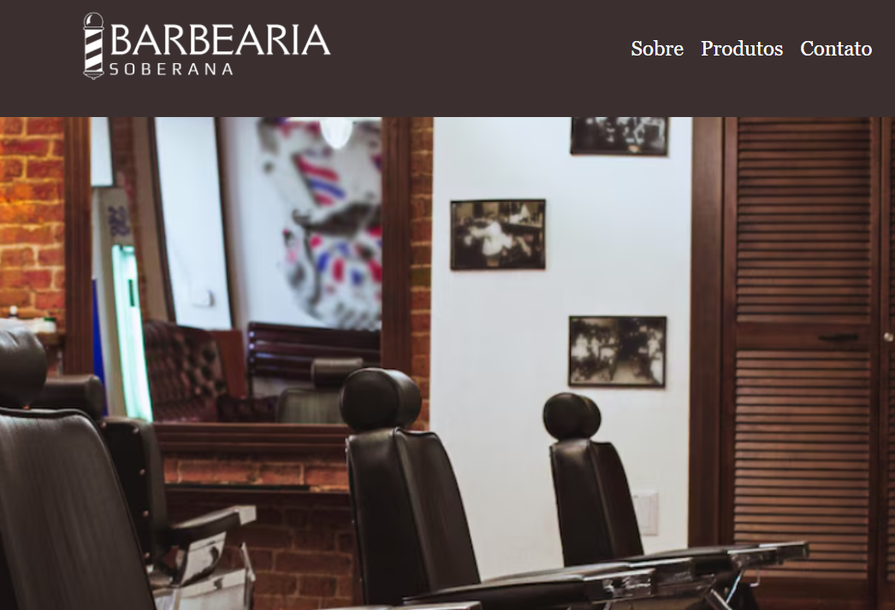
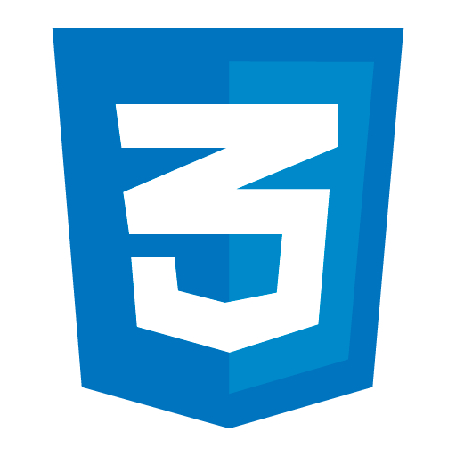
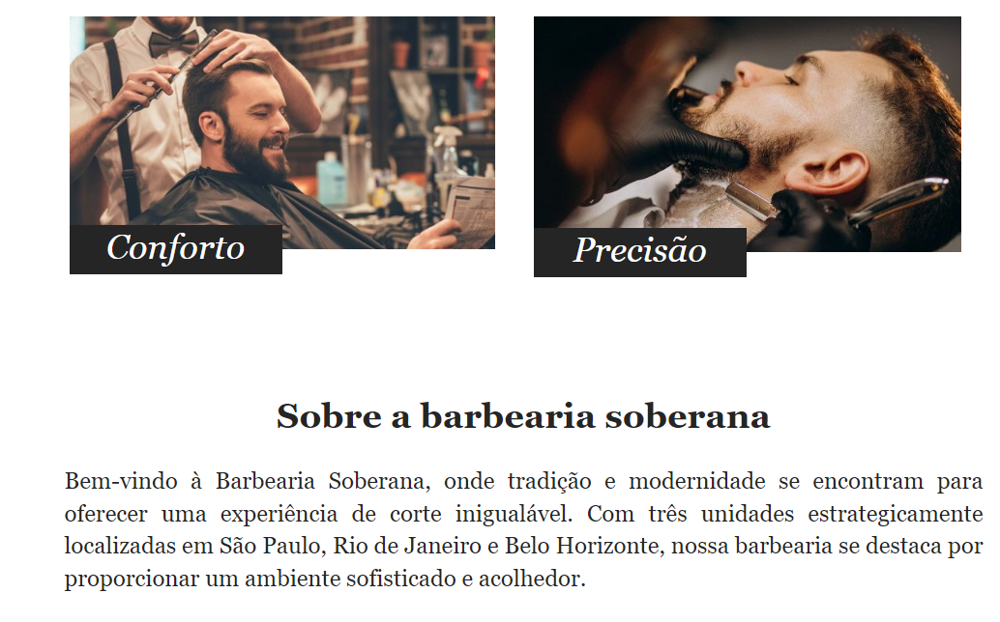

# Barbearia Soberana

Este projeto é um site para a Barbearia Soberana, destacando os serviços oferecidos, a história da barbearia e informações de contato.

## Interface

<div align="center">
  
</div>

## Sumário

- [Tecnologias Utilizadas](#tecnologias-utilizadas)
- [Status](#status)
- [Descrição](#descrição)
- [Funcionalidades](#funcionalidades)
- [Explicação](#explicação)
- [Estrutura do Projeto](#estrutura-do-projeto)
- [Como Usar](#como-usar)
- [Autor](#autor)

## Tecnologias Utilizadas

<div style="display: flex; flex-direction: row;">
  <div style="margin-right: 20px; display: flex; justify-content: flex-start;">
    
  </div>
  <div style="margin-right: 20px; display: flex; justify-content: flex-start;">
    
  </div>
  <div style="margin-right: 20px; display: flex; justify-content: flex-start;">
    
  </div>
</div>

## Status


## Descrição

O projeto Barbearia Soberana é um site que exibe os serviços da barbearia, incluindo corte de cabelo, barba, e pacotes combinados. Além disso, o site fornece informações sobre a localização e formas de contato.

## Funcionalidades

- Exibição de serviços de barbearia
- Informações de contato e localização
- Integração com redes sociais

<div align="center">
  
</div>

## Explicação

```html
<footer class="footer">
    <div class="container">
        <div class="footer-contact">
            <h2>Contato</h2>
            <p>Endereço: Rua Exemplo, 123, São Paulo, SP</p>
            <p>Telefone: (11) 1234-5678</p>
            <p>Email: contato@barbeariaexemplo.com</p>
        </div>
        <div class="footer-social">
            <h2>Siga-nos</h2>
            <a href="#" target="_blank"></a>
            <a href="#" target="_blank"></a>
            <a href="#" target="_blank"></a>
        </div>
    </div>
</footer>
``` 

## Como Usar
`1.` Clone o repositório.

`2.` Abra o arquivo index.html em seu navegador.

`3.` Navegue pelo site para ver os serviços e informações de contato.

## Autor
Desenvolvido por Diego Franco.